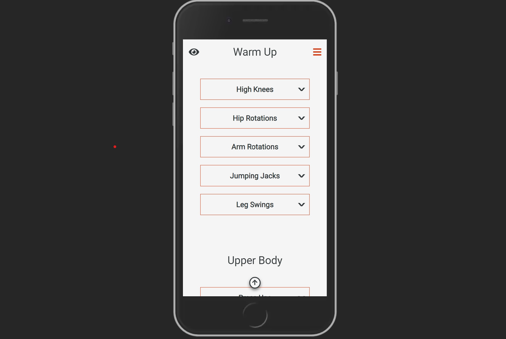
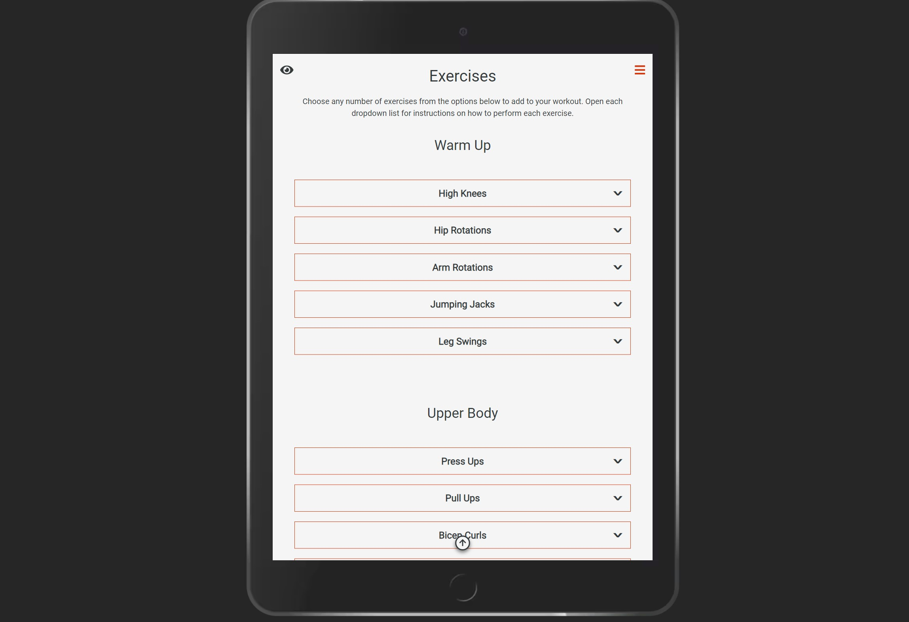
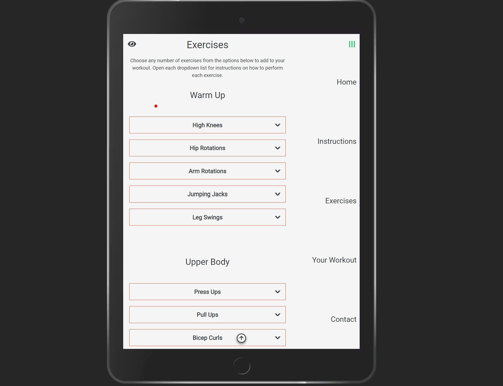
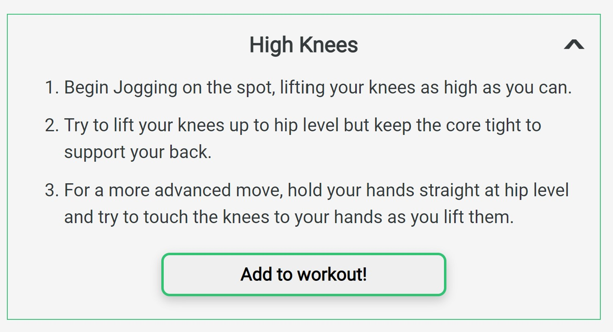
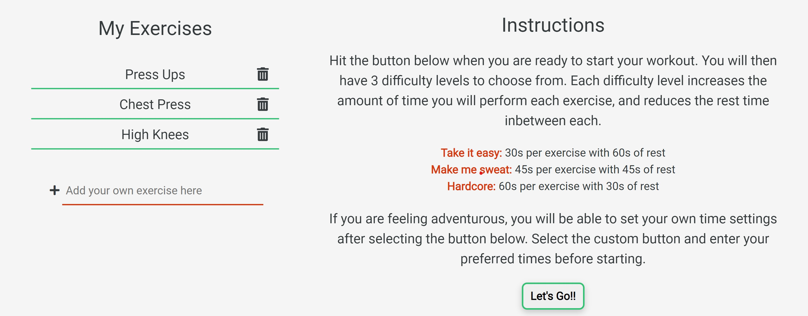
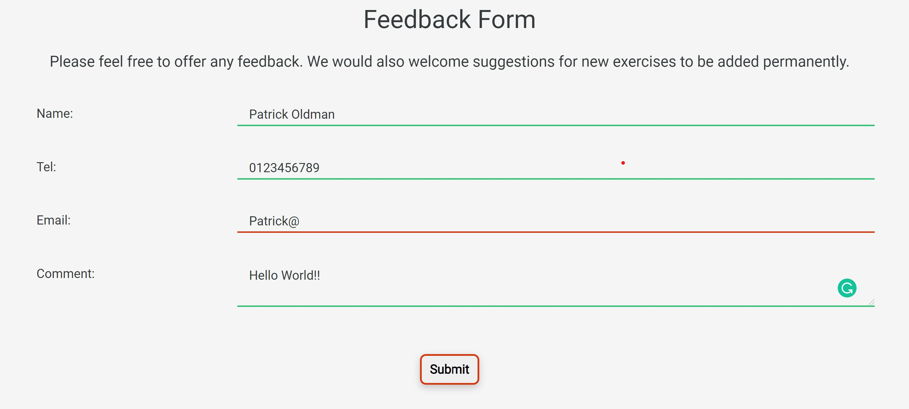
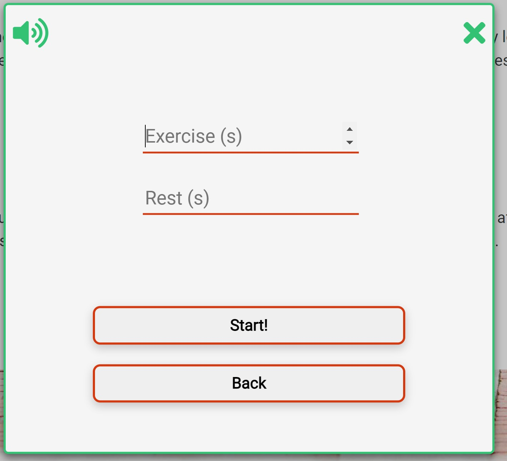
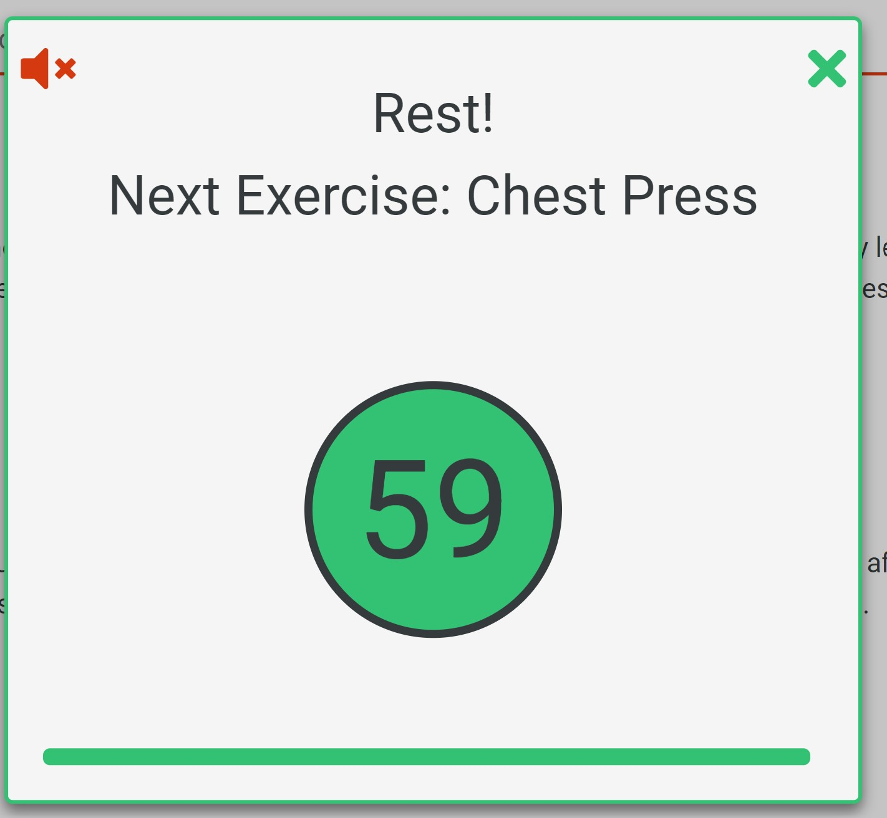

# Workout Buddy

## About

This is my second Milestone Project for my Full Stack Software Development Diploma with Code Institute. I will be using HTML, CSS and JavaScript for this project. The aim is to build on my front end skills by practising my HTML/CSS and implementing JavaScript interactive features. I will also be using the JQuery library for elements.

For this project, I am building a fitness app. The idea is that a user can quickly and easily create a home workout. Included will be some baked in exercises for the user to choose from, and a 'whiteboard' section where the chosen workout exercises will be added to the workout. I also plan to add an option for the user to add their own custom exercise.

The aim is to create a simple app to help people organise their exercise at home, which is more important than ever these days as a lot of us are stuck inside for most of the day.

## UXD

### Strategy

I am looking to cast as wide a net as possible in terms of user base. This app needs to be designed to be used by both fitness newbies and veterans alike.

#### User Stories

I am a fitness beginner and I want:

1. Instructions for how to perform exercises
2. Instructions must not be alienating and explanations should be easy to understand
3. A way to 'progress' their fitness level using the app
4. Positive feedback after completing a workout

I am a fitness 'veteran' and I want:

1. To be able to quickly construct my workout
2. To have a range of exercises to choose from
3. To be able to add my own custom exercises if what I want to do is unavailable
4. To challenge myself
5. For my workout to be saved on the app next time I visit

### Scope

#### Strategy Trade-off Table

Below I have created a trade-off table that addresses the user stories above.

Opportunity/Problem | Importance | Viability
--------------------|------------|-----------
Provide simple exercise instructions in text | 5 | 5
Provide exercise instructions using video | 3 | 1
Add scaling difficulty settings | 4 | 3
Provide users with positive feedback | 3 | 4
Have a large range of exercises baked into the site | 4 | 2
Allow user to add custom exercises on their individual workout | 4 | 4
Create login feature for user profile | 4 | 1
Allow workouts to be stored locally on user browsers | 5 | 5

The website will be built as a Minimum Viable Product. I believe that this project has a great deal of expansion potential, however it will be created with only the most important elements added due to both time constraints as well as my own limitations in terms of knowledge.

For example, it would be useful to create instructional videos for each exercise, however this would be impractical for me to do in terms of time. Instead, I plan to only include textual instructions for the time being.

I will only be adding a relatively small amount of individual exercises baked into the website. This is sensible, as my time is better spent implementing the functionality of the website first. New exercises can always be added later once the functionality is in place.

It would also be useful for a user to be able to create an account and log in. This would then allow them to store their workouts and come back to them. Users could even create their own workout routines and save them on a public server for other users to access. Of course this would involve a great deal of backend development, which is currently outside my skillset. However, a solution for this using JavaScript would be for the workout data to be stored locally to the user's browser, so if they refresh the page or return to it the next day, the workout will still be present.

### Structure

I plan for the website to be structured on one single page. The layout will be simple and responsive as it will be useful for a user to be able to use this on all device types.

The structure will be as simple as possible so as not to overwhelm the user. I want the user to be able to open the website and immediately be able to either create a workout or start their workout with a minimum of fuss. This is especially important for a first time user so as not to create cognitive overload.

The website will conform to web standards in terms of interactive design. Links will be clearly highlighted and signposted. Interactive elements stand out and respond when hovered over.

### Skeleton

The below wireframe gives me an idea of the layout before starting to write any code. It is subject to change if I decide there are better ways of structuring some aspects once the site has been created but I plan to stick to the below as closely as possible.

One element I plan to implement which is slightly different to web standards is that the navbar 'hamburger' element will be on all screen sizes including desktop. My reasoning for this is that it is not so important to have the navigation elements immediately visible on a larger screen - as elements will expand horizontally on larger screens causing the y axis to be much shorter and most of the elements will be already visible on screen. I believe this will result in a more aesthetically pleasing result as I plan for the page to be as minimalist as possible with no visual clutter.

[Wireframe for mobile, tablet, and desktop](documentation/wireframe.pdf)

Since making the above wireframe, the original design has been slightly amended while the website was being created. There is now a hero image background between each section, which provides a simple and pleasant seperation. There are arrows between each section which when pressed, smoothly scroll the user down to the next section.

### Surface

I have chosen a diverse colour palette generated on [Coolers.co](www.coolers.co). 

The background is a slightly off white 'whitesmoke', with most text content being an off black 'onyx' colour so the contrast is not too stark and easier on the eyes. 

Colour comes from red and green elements on the page. The red pairs well with the background hero images used, as these feature a lot of red elements. Red and green are used in terms of interactive design as well: in many cases if something 'needs doing' such as the form inputs, they will show as red, and if they are ready to be submitted they will turn green. This provides the user with simple visual feedback on their action.

The red, amber and green colours are also used in the workout timer function in a mimic 'traffic light' system. As time is running out on the timer, the colour scheme changes from green to amber, then to red to provide the user with visual feedback.


The hero images used generally match the colour palette as mentioned above as most of them feature red elements, providing the site with a pleasant viewing experience.

All font is 'Roboto' from the Google Fonts collection. This is a very typical font for a website, due to it's simple and legible nature so it makes sense to be included in what is a simple design.

## Features

### Responsive Design

* The website is made to be viewed on all device types, using the Bootstrap grid system. On smaller screens most elements fully fit the horizontal width of their container, while on larger screens elements are more spaced out horizontally. A good example of this is the "My Exercises" section.

  - On Smaller screens, the "My Exercises" items fill the container horizontally.

  

  - On Larger screens, the "My Exercises" items are in four columns.
  
  

  - On tablet screens, the "My Exercises" items are in two columns.

  

* The Navbar, as mentioned in the Structure section, is always hidden within the 'Hamburger' on both large and small screens. This was to conserve screen real estate and to improve the visual aspect of the site. However there is still some responsive interaction.

  - On smaller screens the navbar fills the whole screen when opened

  

  - On larger screens this opens to the side, allowing the user to continue using the site.

  

  - Tablet screens have a similar effect to large, only covering part of the window, while narrowing the content to the left.

  

### Navigation

* As well as the navbar accessible by the fixed hamburger on the top right of the screen, there are also navigation arrows between each section.

  - Downwards facing arrows at the bottom of each section allow the user to quickly access the next section, should they prefer not to scroll past the hero images that divide each section. The scrolling action that occurs is a smooth rather than instant motion.
  

  - Once the user has scrolled further than 20px from the top of the screen, an upward facing arrow button appears at the middle bottom of the screen. Upon selection, this arrow returns the user to the very top of the page.


### User Preferences

* User preferences are saved in the browser local storage, meaning that when the user either refreshes the page or returns to it at any other time, the site will look exactly the same as how they left it. There are three main features which carry this function.

  - The "My Workout" section.
      - Exercises added by the user to this section are saved to local storage. This goes for both 'preset' exercises added and also custom exercises.
      - Items are also deleted from local storage when deleted by the user. The data in local storage will always match what appears on the screen, ensuring that it stays the same upon reload.
      - This is useful, as the user does not have to recreate their favourite workout routine every time they access the page.

      
  
  - Light/Dark toggle
    - The page will always reload to whichever viewing mode it was last set to on that browser.
    - This is useful, as the user will generally have a preferred colour scheme, and it is nice that they don't have to toggle this every time they access the page.

  - Sound toggle
    - Sound effects played during the workout can be either turned to "on" or "off".
    - Every time the user toggles the button, this info is saved to local storage so that on refresh this data remains the same.
    - This is useful, as the user will generally have a preference for this option. If the user has switched it to 'off' on their first session, and returns the next day, they will expect this setting to stay the same and not be surprised by the sound effects.

### Visual Interactive Feedback

* All elements that the user can click on or change provide an immediate visual response when interacted with. This ranges from colour changes on CSS hover pseudoclasses to form validation.

  - CSS hover pseudoclasses
    - Most interactive items change colour upon hover as well as turning into hand cursors as is standard. 
    - In the example below, the cursor is hovering over the 'trash' icon next to the text 'Press Ups'. Possible user interaction is clear due to the colour change.

    

    - This feature is also included on:
      - Light/Dark mode toggle
      - Navbar Hamburger
      - Navbar Items
      - 'Next Section' down arrow
      - 'X' logo in workout modal
      - 'Back to top' arrow
  
    - On larger screens, all buttons grow slightly in size when hovered over.
      - This feature does not work for smaller screens as these will generally be used as touchscreens and a hover feature is less useful. When testing the site on my mobile phone I disliked the effect that this feature had so I kept this feature to large screens only.

  - Navbar Hamburger rotates 90 degrees when navbar is opened.
  
  
  - Exercises Section
    - When opening the dropdown 'accordions' in the 'Exercises' section, the border of each list item changes colour from red to green.
    - This simple effect elicits an instant positive response from the user and encourages them to add this item to the workout.
    
    - As can also be seen in the above image, the arrow next to the h4 element in each list item rotates 180 degrees when the list item is opened. This provides an extra visual feedback element to the user.
    - After the 'Add to workout' button has been selected, the background colour changes to green, and the window auto closes after a short timeout. This provides the user with feedback that they have successfully added the item to the workout.
    
  
  - My Workout Section
    - When the user has added an item to the workout from the exercise list above, this item is instantly added to their 'My Exercises' list in the 'My Workout' section.
    - As shown in the above image, I added the 'High Knees' exercise, this can now be seen in the 'My Exercises' list below, as well as the exercises already seen on the screenshots made higher up in the features section.
    
    - It is easy to delete any of items by simply clicking the trash icon.
    - The user can add a custom exercise to the list as well by filling in the 'Add your own exercise here' form. In the screenshot above, it can be seen that 'Chest Press' is included as this has been manually entered this way, as it cannot be added from the 'Exercises' section above.
  
  - Form Validation
    - I have added visual form validation elements to all inputs.
      - When valid text is entered to input forms, the bottom border colour changes from red to green. This effect can be clearly seen below - contrast the green border in the input now that includes valid text to the previous image, where the input is empty.
    
    - The 'Let's Go!!' button in the 'My Workout' section has a red border if the workout list is empty, but turns green after items have been added.
    
    
    - All items in the Feedback Form section exhibit the same effects for both the input bottom border colour and the button, which in this case is a submit button which only turns green once all form inputs are valid.
    - As the email input is only valid once it includes an @ symbol with content afterwards, I used a regex (regular expression) in my code to ensure that the border properties changed correctly.
      - Invalid Form due to email input
      
      - Valid Form
      
  
  - Toasts
    - Toasts briefly appear on screen if form data is invalid on submission on all inputs except for the form submit button. These time out after 6 seconds.
      - For example, when entering no characters to the add custom exercise input and entering:
      
    - Toast appears on valid form submission, thanking the user.
      

### Workout Timer

* When selecting the 'Let's Go!!' button, which starts the workout, a modal is triggered which appears in front of all other content.
  - From the first screen, the user can select a difficulty option which selects different timeframes for the exercises and rest periods depending on the difficulty. The user has already been familiarised with the respective times in the Instructions section.
    - On the top left is the sound toggle button. If the sound is set to on, there are some sound effects which play during and after the workout, which will be described in more detail later.
    - On the top right is a close button. This is always active and will cancel the workout completely if selected in the middle of a timer.
    
  - If the user selects 'custom', the content of the modal changes to two inputs for the user to enter their desired times for each exercise and rest period respectively. The workout will then begin as normal when the user selects the 'Start' Button.
  
  - Once the workout has started, either by selecting one of the difficulties on the first screen or starting a custom workout, a countdown timer is displayed.
  
    - The countdown ticks for 15 seconds, giving the user time to prepare to start the workout. Every five seconds, there is visual feedback as the border colour, the background of the number and the progress bar change. First green, then amber and finally to red in a traffic light system.
    - The progress bar at the bottom of the modal window reduces in size proportionally to the time remaining, providing further visual feedback.
    - If the sound toggle is on, there will also be audio cues for the user. Every five seconds a short 'ding' sound is played, while once the timer has elapsed a buzzer sound is played.
  - Once the countdown has elapsed, a new timer is triggered with the first exercise in the user's workout list. The content of the modal displays the current exercise.
    
    - As with the countdown, the colours of the border, number background and progress bar change. This time they change with 20 seconds and 10 seconds remaining to amber and red respectively.
    - Once again, the progress bar reduces in size in proportion to the remaining time.
    - As with the countdown, if sound is switched on, the audio cues are triggered, again at 20 and 10 seconds remaining for the 'ding' and the 'buzz' once the exercise is complete.
  - When the exercise is complete, if there are further exercises remaining on the workout, the rest countdown is triggered.
    - The rest screen is very similar to the workout. The text content informs the user to 'rest' and also displays the next exercise in the workout so the user is prepared for what is to come.
    
    - Visual and audio feedback is provided to the user in exactly the same way as in the exercise timer.
  - If the current exercise is complete, and there are no further exercises in the workout, the congratulations screen is triggered.
  
    - There is an image of a champagne bottle displayed as well as text congratulating the user
    - If the sound toggle is switched on, a 'cheer' sound effect is played
    - The user has the option to share their workout to social media. Each link currently opens in a seperate tab to the homepage of the respective social media site.

### Future Features

As mentioned previously, I think this site has potential for many additional features which have not been implemented at this point for various reasons. I will list some further ideas below.

1. Add further exercises. Add a section for stretches to be performed at the start of each workout alongside warmup exercises.
2. Include more detailed instructions for each exercise. This could be in the form of images/gifs/videos.
3. On the "My Exercises" list in the "My Workout" section, allow the user to change the order of exercises on the list.
4. Allow users to log in and create accounts. This could allow them to create workouts and store them in a shared database which any user can access like a social media site. For example the running/cycling etc application Strava allows users to save running routes for other users to access and look at. This could work in a similar way, but for workout routines. A completed workout could also be shared on the user's profile.
5. Add a play/pause function to the workout timers. This was an idea I had at the start of the project, however I could not find a way for this to work easily as the timers use a setInterval() method which cannot be easily interrupted without being cancelled completely. This is something I would like to return to once I have more experience with JavaScript, however for the time being the timer will have to be strict with the user. Once they have started the workout, they have to either complete it completely or cancel it by closing the modal box.

## Issues Overcome

### Timer Function

When starting the project, I knew that my biggest challenge would be implementing the timer feature which plays during the workout. It took me a while to figure out the best strategy to do this (and not without help from the Code Institute Tutor Igor!).

Initially, my plan was to create an empty array for the exercises which would then be pushed to every time the user added a new exercise to their custom workout. Then, the timer function would somehow loop through each item until the end.

This worked well, however there was one problem - deleting items from the array. While I was able to use a splice() method to remove e.g. the last item from the array, I was unable to find a way of removing the CORRECT item from the array.

For example, if the array is as follows: "let exercises = ['pull ups', 'press ups', 'squats']", and the user decides they no longer want to include press ups in their workout, how do I make sure that it is press ups that is removed from the array, rather than simply the last item or the first item?

My initial workaround for this was to simplify the array, and instead of having it be a list of the workout exercises as strings, to simply have it as a numbered list: "let exercises = [1, 2, 3]". This way, it wouldn't matter which item was deleted from the array, the important thing was that it was at least the correct length.

However this method was imperfect. Ideally, I wanted the array to include strings of the exercise names. I could then add each string to the HTML so the user could see which exercise they were meant to be doing as the timer runs. I had to change the way I was thinking about it and start from scratch.

My solution was to trigger a 'getExercises' function every time a new workout was started by the user, rather than at the point where users add each exercise to the workout list on the webpage. So every time a workout starts, each item in the list is immediately pushed to the array, which can then be looped through. This had an added bonus too; as each item is already in local storage, it doesn't matter if the page is refreshed. The array is generated fresh each time a workout is started.

The next difficulty would be to create the timer itself, particularly making it loop correctly through each item in the array. I spent quite some time trying to make it work by looping through each item in the array with a forEach() method, a standard for() method etc but could not figure it out.

Below is the general idea of the code I was using, but this was not working at all, no matter what I tried.

```
let startWorkout = function(sec){
  getExercises();
  exercises.forEach(exercise => {
    timer = function () {
      let timer1 = setInterval(function() {
        $(".modal-content").html(`
          <p class="modal-heading">${exercise}</p>
          <div class="timer">
            <p class="timerdisplay">${sec}</p>
          </div>
        `);
        sec--1;
        if (sec1 < 0) {
        clearInterval(timer1);
      }, 1000)
    }
  })
}
```

In the end, after some advice from Igor at Code Institute, I was once again able to refresh my thinking. I cascaded several functions through each other. The structure of the function goes like the below.

1. The user presses 'start workout'
2. This opens up the modal, and the user selects their difficulty
3. The exercises array is generated from the exercise list as created by the user as described above
4. The timer function is immediately triggered. It takes the first item from the exercises array
5. The timer ticks down for the set time depending on difficulty for that exercise
6. Once complete, the first exercise is removed from the exercises array
7. The code checks if there are any items in the array, if the array is now empty the workout ends, and the modal innerHTML changes to the congratulations screen
8. If there are items still on the array, the restTimer function is triggered, which ticks down for the set amount of time depending on difficulty
9. Once complete the timer function is triggered again from the 'new' first item in the array

## Technologies Used

### Languages Used

* HTML5
* CSS3
* JavaScript

### Frameworks, Libraries and Programs Used

* [Bootstrap v4.6](https://getbootstrap.com/docs/4.6/getting-started/introduction/) - Mainly used for content positioning and responsiveness
* [jQuery](https://jquery.com/) - Used for interactive elements on the DOM and to simplify JavaScript use
* [Fontawesome](https://fontawesome.com/) - This was used for all icons on the page
* [Google Fonts](https://fonts.google.com/) - I used the font Roboto
* [Git](https://git-scm.com/) - Used for version control
* [VS Code](https://code.visualstudio.com/) - Text editor used to write all code and git version control from terminal
* [Github](https://github.com/) - GitHub is used to store the project's code after being pushed from Git
* Github Projects - Agile kanban project management tool used set and track tasks within the project, making workflow easy
* [Balsamiq](https://balsamiq.com/) - Balsamiq was used to create the [wireframe](documentation/wireframe.pdf) during the design process
* [Coolers](https://coolors.co/) to generate the colour pallette
* [Compressjpeg](https://compressjpeg.com/) - used to compress hero images
* [Reduceimages.com](https://www.reduceimages.com/) - used to lower resolution of hero images for smaller screens

## Credits

### Images

* Image of woman performing sit ups taken from [unsplash.com](https://unsplash.com/photos/lrQPTQs7nQQ). Photographer Credit - [Jonathan Borba](https://unsplash.com/@jonathanborba).
* Image of feet walking up concrete steps taken from [unspash.com](https://unsplash.com/photos/PHIgYUGQPvU). Photographer Credit - [Bruno Nascimento](https://unsplash.com/@bruno_nascimento).
* Image of women on yoga mats taken from [unsplash.com](https://unsplash.com/photos/gJtDg6WfMlQ). Photorapher Credit - [Bruce Mars](https://unsplash.com/@brucemars).
* Image of man performing pushups taken from [unsplash.com](https://unsplash.com/photos/zbF-lW3k1QU). Photographer Credit - [Gabe Pierce](https://unsplash.com/@gaberce).
* Champagne bottle SVG in congratulations section from [pixabay.com](https://pixabay.com/vectors/bottle-champagne-1936658/). Image by [succo](https://pixabay.com/users/succo-96729/).

### Audio

* 'Ding' sound effect used for timer countdown taken from [freesoundslibrary.com](https://www.freesoundslibrary.com/ding-sound-effect/).
* 'Cheer' sound effect played at the end of the workout taken from [freesoundslibrary.com](https://www.freesoundslibrary.com/big-crowd-cheering/).
* 'Buzzer' sound effect played at end of each exercise taken from [freesoundslibrary.com](https://www.freesoundslibrary.com/buzzer-sound/).

### Text

* Exercise instructions text taken and adapted from several websites as needed
  - [cnet](https://www.cnet.com/)
  - [healthline.com](https://www.healthline.com/)
  - [Mens Health](https://www.menshealth.com/uk/)
  - [Openfit.com](https://www.openfit.com/)
  - [spotebi.com](https://www.spotebi.com/)


### Acknowledgements

* Thanks to Code Institute tutor Igor for helping me figure out the best way to implement the timer feature as described in the [Timer Function](#timer-function) section of [Issues Overcome](#issues-overcome).